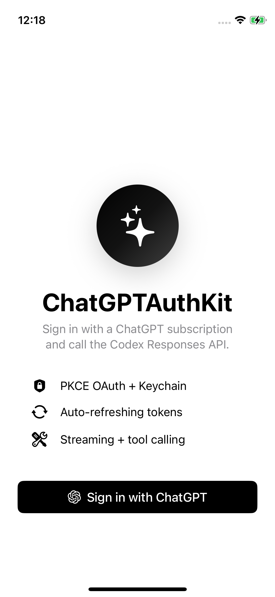

# chatgpt-auth-kit (React Native)

Sign in with a ChatGPT subscription and call the Codex Responses API from your React Native app.

<p align="center">
  
</p>

**No third-party OpenAI SDK dependency.** Auth, secure-storage credentials, auto-refresh, and minimal Responses / Models / Usage clients. To plug into another OpenAI client (the official `openai` npm SDK, raw `fetch`, etc.), see [Plugging in other OpenAI SDKs](#plugging-in-other-openai-sdks).

## Install

```bash
npm i @mobai-app/chatgpt-auth-kit
npm i \
  react-native-keychain \
  react-native-inappbrowser-reborn \
  react-native-tcp-socket \
  react-native-url-polyfill \
  react-native-get-random-values \
  react-native-fetch-api \
  web-streams-polyfill \
  text-encoding \
  js-sha256
cd ios && pod install
```

`@mobai-app/chatgpt-auth-kit` ships zero runtime dependencies. The list above is the full set of native modules + Hermes polyfills the lib needs at runtime; install order doesn't matter, but the bootstrap order in your app entry does. At the top of `index.js` (or `App.tsx`), before any `@mobai-app/chatgpt-auth-kit` import:

```ts
// 1. URL + URLSearchParams
import 'react-native-url-polyfill/auto';
// 2. crypto.getRandomValues (PKCE verifier randomness)
import 'react-native-get-random-values';
// 3. TextEncoder + TextDecoder (Hermes ships TextEncoder; we need TextDecoder for SSE)
import { TextEncoder, TextDecoder } from 'text-encoding';
(globalThis as any).TextEncoder = (globalThis as any).TextEncoder ?? TextEncoder;
(globalThis as any).TextDecoder = TextDecoder;
// 4. crypto.subtle.digest('SHA-256') (PKCE challenge hash)
import { sha256 } from 'js-sha256';
const g = globalThis as any;
if (!g.crypto) g.crypto = {};
if (!g.crypto.subtle) {
  g.crypto.subtle = {
    digest: async (_algo: string, data: BufferSource) => {
      const bytes = data instanceof ArrayBuffer ? new Uint8Array(data) : new Uint8Array((data as any).buffer ?? data);
      const hex = sha256(bytes);
      const out = new Uint8Array(hex.length / 2);
      for (let i = 0; i < out.length; i++) out[i] = parseInt(hex.substr(i * 2, 2), 16);
      return out.buffer;
    },
  };
}
// 5. Streaming fetch (`res.body.getReader()`) for SSE
import { polyfillGlobal } from 'react-native/Libraries/Utilities/PolyfillFunctions';
import { ReadableStream } from 'web-streams-polyfill/dist/ponyfill';
import { fetch as rnFetch, Headers, Request, Response } from 'react-native-fetch-api';
polyfillGlobal('ReadableStream', () => ReadableStream);
polyfillGlobal('fetch', () => (...args: any[]) =>
  rnFetch(args[0], { ...(args[1] ?? {}), reactNative: { textStreaming: true } }),
);
polyfillGlobal('Headers', () => Headers);
polyfillGlobal('Request', () => Request);
polyfillGlobal('Response', () => Response);
```

Heavier production apps may prefer `react-native-quick-crypto` over the JS `js-sha256` shim (true WebCrypto, native-backed) — set up its global install per its README in place of step 4.

## iOS setup

In `ios/<App>/Info.plist`:

```xml
<key>NSAppTransportSecurity</key>
<dict>
    <key>NSAllowsLocalNetworking</key>
    <true/>
</dict>
<key>NSLocalNetworkUsageDescription</key>
<string>Used to receive the OAuth callback on 127.0.0.1:1455.</string>
```

## Usage

```ts
import {
  OAuthFlow,
  CredentialsStore,
  RefreshingCredentialsProvider,
  ResponsesClient,
} from '@mobai-app/chatgpt-auth-kit';

async function login() {
  const creds = await OAuthFlow.run();
  await CredentialsStore.save(creds);
  return creds;
}

async function chat() {
  const creds = (await CredentialsStore.load()) ?? (await login());
  const provider = new RefreshingCredentialsProvider(creds, { store: CredentialsStore });
  const client = new ResponsesClient(provider);

  for await (const event of client.stream([
    { role: 'system', content: 'You are helpful.' },
    { role: 'user',   content: 'Plan a weekend in Berlin' },
  ])) {
    if (event.type === 'delta') process.stdout.write(event.text);
  }
}
```

## Auto-refresh

For long-lived sessions, wrap credentials in a `RefreshingCredentialsProvider` once at app start. It hands out fresh credentials on demand, persists each refresh to secure storage, and coalesces concurrent refreshes:

```ts
const provider = new RefreshingCredentialsProvider(creds, { store: CredentialsStore });
const chat   = new ResponsesClient(provider);
const models = new ModelsClient(provider);
const usage  = new UsageClient(provider);
```

Every `.fetch()` / `.stream(...)` call goes through the provider, so a near-expiry token is refreshed before the request goes out — you never have to call `OAuthClient.refresh(...)` yourself. For one-off use, each client also accepts a single `Credentials` value directly.

## Discover available models

```ts
const models = await new ModelsClient(provider).fetch();
```

## Read plan & quota

```ts
const usage = await new UsageClient(provider).fetch();
console.log(usage.planType, usage.primary?.usedPercent);
```

## Plugging in other OpenAI SDKs

The built-in `ResponsesClient` is intentionally minimal (text streaming + usage). If you'd rather use the official `openai` npm SDK or another HTTP client, point it at the Codex backend with the right headers and body shape. ChatGPTAuthKit gives you the credentials; the integration is config in your app.

**Where it lives**
- Host: `chatgpt.com`
- Base path: `/backend-api/codex`
- Bearer token: `credentials.accessToken`

**Headers Codex requires**
- `Authorization: Bearer <accessToken>`
- `ChatGPT-Account-ID: <accountID>`
- `OpenAI-Beta: responses=experimental`
- `originator: codex_cli_rs` (or your app's identifier)

**Body shape Codex enforces** — a 400 if any of these is wrong
- `instructions: string`
- `reasoning: { effort, summary }`
- `include: ["reasoning.encrypted_content"]`
- `store: false`
- `input` as a structured array — system messages collapse into `instructions`, user/assistant become `{type: "message", role, content: [{type: "input_text"|"output_text", text}]}`

### Example: official `openai` npm SDK

Add the dep to your app:

```bash
npm i openai
```

Drop these helpers anywhere in your app:

```ts
import OpenAI from 'openai';
import { Credentials, CredentialsProvider } from '@mobai-app/chatgpt-auth-kit';

export function makeOpenAI(creds: Credentials, originator = 'codex_cli_rs'): OpenAI {
  return new OpenAI({
    apiKey: creds.accessToken,
    baseURL: 'https://chatgpt.com/backend-api/codex',
    defaultHeaders: {
      'OpenAI-Beta': 'responses=experimental',
      originator,
      ...(creds.accountID ? { 'ChatGPT-Account-ID': creds.accountID } : {}),
    },
    dangerouslyAllowBrowser: true, // RN's fetch is browser-flavored
  });
}

/** MacPaw caches the bearer at construction; build a new client per request to keep auto-refresh effective. */
export async function makeOpenAIFromProvider(provider: CredentialsProvider): Promise<OpenAI> {
  return makeOpenAI(await provider.currentCredentials());
}

export function codexQuery(prompt: string, opts: { model?: string; instructions?: string; reasoningEffort?: 'minimal' | 'low' | 'medium' | 'high'; stream?: boolean } = {}) {
  return {
    model: opts.model ?? 'gpt-5.5',
    input: [{ type: 'message', role: 'user', content: [{ type: 'input_text', text: prompt }] }],
    instructions: opts.instructions ?? "Follow the user's instructions.",
    reasoning: { effort: opts.reasoningEffort ?? 'medium', summary: 'auto' },
    include: ['reasoning.encrypted_content'],
    store: false,
    stream: opts.stream ?? true,
  };
}
```

Then use it like any `openai` client:

```ts
const client = await makeOpenAIFromProvider(provider);
const stream = await client.responses.create(codexQuery('Say hi.'));
for await (const event of stream) {
  if (event?.type === 'response.output_text.delta' && event.delta) {
    process.stdout.write(event.delta);
  }
}
```

Tools, function calling, and multi-turn conversation state are surface area of whichever client library you pick — Codex's body-shape and header rules above apply equally to those flows.

## Caveats

- On iOS first run the user is prompted for **Local Network** access (the loopback listener triggers it).
- **New Architecture:** `react-native-tcp-socket` (the loopback transport) doesn't yet work under RN's New Architecture. Currently supported configurations: **RN 0.72 – 0.84 with the New Architecture disabled.** RN 0.85+ is new-arch-only and the loopback listener silently won't bind — the lib will not work there until the underlying socket library adds Turbo Module support. Track [react-native-tcp-socket](https://github.com/Rapsssito/react-native-tcp-socket) for status.

## License

MIT.
